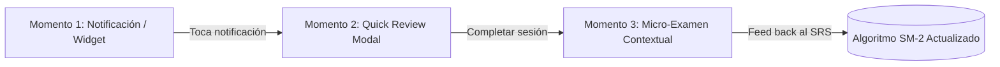
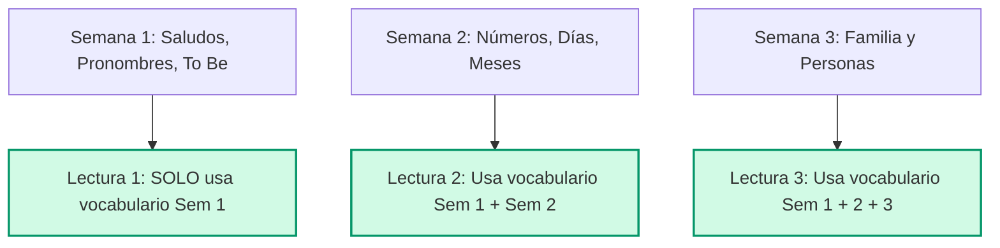
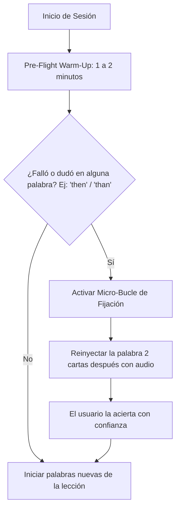

# 🧠 Documento Maestro de Discusión Pedagógica y Estrategia de Retención
**Escuela de Inglés Americana**  
*Enfoque: Adherencia al SRS (SM-2), Micro-Learning por Notificaciones y Reconocimiento Rápido en Contexto*  
*Fecha: Septiembre 2026 | Estado: Consenso Pedagógico y de Producto Aprobado*

---

## 1. Diagnóstico Inicial: Las 3 Condiciones Críticas de Éxito

El método pedagógico de la plataforma está diseñado para alcanzar una **tasa de retención léxica y fluidez cercana al 90%**. Sin embargo, este rendimiento se desploma drásticamente si el usuario promedio no cumple tres condiciones operativas:

```
                  ┌──────────────────────────────────────────────┐
                  │          EFICACIA TEÓRICA: ~90%              │
                  └──────────────────────┬───────────────────────┘
                                         │
                 ┌───────────────────────┼───────────────────────┐
                 ▼                       ▼                       ▼
      [ Adherencia al SRS ]    [ Tiempo de Exposición ]  [ Consumo Integral ]
      Peligro: Backlog de      Peligro: Abandono por     Peligro: Conocimiento
      100+ tarjetas y freno    expectativa de atajos     pasivo (solo tarjetas,
      del algoritmo SM-2.      (requiere 150-200 hrs).   sin lecturas/writing).
```

### 1.1. Adherencia al SRS (Spaced Repetition System)
- **El problema:** Si el usuario acumula más de 50 o 100 tarjetas atrasadas por ausentarse 5 a 7 días, el algoritmo SM-2 pierde su calibración de intervalos. Al regresar, el estudiante experimenta **ansiedad por sobrecarga cognitiva** y termina desinstalando la app.
- **La solución:** Evitar la acumulación pasiva mediante micro-estímulos diarios y un protocolo de "Modo Rescate".

### 1.2. Tiempo de Exposición Distribuida
- **El problema:** Dominar las 2,558 palabras del currículo exige entre **150 y 200 horas de estudio distribuido** (20-30 minutos diarios a lo largo de 8-12 meses). La falta de hábitos constantes destruye la memoria de trabajo antes de consolidar la memoria a largo plazo.
- **La solución:** Acercar el contenido al usuario en momentos intersticiales (transporte, pausas laborales, antes de dormir) mediante el teléfono sin exigir sesiones largas.

### 1.3. Consumo de Componentes Avanzados (Evitar la Trampa Pasiva)
- **El problema:** Las flashcards por sí solas solo generan reconocimiento pasivo o traducción literal. Sin las **Lecturas de Comprensión** y los **Writing Prompts** de B1/B2, el alumno jamás consolida fluidez productiva real.
- **La solución:** Conectar cada palabra con su contexto funcional desde A1 mediante oraciones completas y micro-retos de comprensión.

---

## 2. El Principio Motor: El "Efecto Eureka" en el Nivel A1

> **Tesis fundamental:** *El éxito en A1 define el éxito de toda la aplicación.*

Si un estudiante principiante siente que el inglés es una lista infinita de términos aislados (`car = carro`, `delay = retraso`), la fatiga mental gana la batalla. 

Por el contrario, cuando un alumno de A1 lee un texto o una frase real y su cerebro **identifica de forma instantánea 3 de las 4 palabras clave aprendidas el día anterior**, se produce un **disparador neurobiológico de dopamina (Efecto Eureka)**:
- *"¡Lo leí y lo entendí sin traducirlo en mi cabeza!"*
- Esa pequeña victoria temprana transforma la percepción del idioma: pasa de ser una materia de estudio a convertirse en una **habilidad real en funcionamiento**.

---

## 3. Ecosistema de Notificaciones: "Spaced Push Notifications"

Las notificaciones tradicionales (*"¡Hora de estudiar!"*) tienen una tasa de ignorado o bloqueo superior al 95%. La solución radica en convertirlas en **estímulos de recuperación activa (Active Retrieval)**.

### 3.1. Regla de Oro: Carga Cognitiva Mínima (Máximo 3 Palabras)
- Jamás enviar bloques masivos de vocabulario.
- Si una lección contiene 9 o 12 palabras, se distribuyen en **3 notificaciones escalonadas a lo largo del día (Estrategia de Goteo / Drip Campaign)**.

### 3.2. Formatos Visuales Aprobados vs. Descartados

```
┌────────────────────────────────────────────────────────────────────────────┐
│ FORMATOS APROBADOS (Elegancia, sobriedad y efectividad)                    │
├────────────────────────────────────────────────────────────────────────────┤
│                                                                            │
│ 1. Estilo A: "Lista Minimalista" (Para pausas rápidas)                     │
│    • Título: 🧠 Repaso relámpago: Lección de ayer                          │
│    • Cuerpo:                                                               │
│      🇺🇸 Butterfly 🦋 (Mariposa)                                            │
│      🇺🇸 Schedule 📅 (Horario)                                              │
│      🇺🇸 Environment 🌳 (Medio ambiente)                                    │
│      *Toca para practicar en 30 seg →*                                     │
│                                                                            │
│ 2. Estilo B: "Palabra en Contexto" (Para consolidación profunda)           │
│    • Título: 🇺🇸 ¿Recuerdas "delay"? /dɪˈleɪ/                               │
│    • Cuerpo:                                                               │
│      "Our flight has a delay."                                             │
│      (Nuestro vuelo tiene un retraso.)                                     │
│      *Toca para ver las 2 palabras restantes →*                            │
│                                                                            │
├────────────────────────────────────────────────────────────────────────────┤
│ FORMATO DESCARTADO                                                         │
├────────────────────────────────────────────────────────────────────────────┤
│ ❌ Trivia Infantil / Gamificación estridente (Opción múltiple en texto)    │
│    Motivo: Degrada la percepción de sobriedad de la Escuela Americana y    │
│    genera rechazo en profesionales y estudiantes adultos serios.           │
└────────────────────────────────────────────────────────────────────────────┘
```

---

## 4. El Embudo de Retención en 3 Momentos

La integración de la interfaz se articula en tres niveles progresivos de compromiso:



### Momento 1: En Pantalla de Bloqueo / Widget (Duración: 3 segundos)
- **Función:** Imprimación léxica pasiva.
- **Acción del usuario:** Lectura instantánea en su pantalla de bloqueo o en el widget de la pantalla de inicio mientras revisa el teléfono. No requiere abrir la aplicación si no dispone de tiempo.

### Momento 2: Modal de Repaso Relámpago (Duración: 15 a 30 segundos)
- **Función:** Deep Link directo sin pasar por el Home.
- **Visual:** Tarjeta limpia con tipografía cuidada, transcripción fonética IPA (`/ˈbʌtərflaɪ/`), iconografía sutil, oración de ejemplo y dos botones de interacción rápida:
  - `[ Lo recuerdo ✓ ]` (Intervalo positivo en SM-2).
  - `[ Repasar otra vez ]` (Tarjeta marcada para recirculación en el mismo día).

### Momento 3: El Micro-Examen Contextual (Duración: 45 a 60 segundos)
- **Función:** Recuperación activa desafiante (*Desirable Difficulty*).
- **Visual:** Estética **Dark Elite** (fondo azul marino pizarra, tipografía condensada clara y acentos dorados).
- **Mecánica principal (Cloze en Contexto):**
  ```
  ┌──────────────────────────────────────────────────────────┐
  │  ⚡ Reto rápido A1 (3 de 5)                               │
  │                                                          │
  │  "Our flight has a ________."                            │
  │  (Nuestro vuelo tiene un retraso.)                       │
  │                                                          │
  │  [ delay ]             [ schedule ]          [ ticket ]  │
  │                                                          │
  │                 ⎯⎯⎯⎯⎯ desliza para continuar ➔            │
  └──────────────────────────────────────────────────────────┘
  ```

---

## 5. Dinámica Pedagógica del Micro-Examen (The 60-Second Challenge)

El micro-examen no debe concebirse como una evaluación punitiva, sino como un **gimnasio de reconocimiento rápido**. Se compone de 3 mecánicas rotativas:

1. **Cloze Contextual (Llenar el hueco funcional):**
   - El alumno lee la frase completa en inglés y selecciona el término exacto que da sentido a la situación cotidiana.
2. **Decodificación Auditiva (Ear Spotting):**
   - Se reproduce el audio con pronunciación americana nativa y el alumno toca la palabra dentro de una frase corta, conectando oído y texto de forma simultánea.
3. **Reconocimiento en Micro-Párrafo (Reading Spotting):**
   - Un texto de dos oraciones que entrelaza el vocabulario de la semana actual con el de semanas anteriores. Se formula una pregunta de comprensión rápida de 5 segundos.

### Disparadores de Activación:
- **Disparador 1 — "Warm-Up" Pre-Lección:** Antes de desbloquear una lección nueva (ej. Semana 14), la app presenta 30 segundos de activación con 3 preguntas clave de la lección anterior (Semana 13). La mente entra "caliente" al contenido nuevo.
- **Disparador 2 — Reto Nocturno de Cierre (8:00 PM - 9:00 PM):** Una notificación breve que invita al micro-examen de 45 segundos para fijar las conexiones antes del descanso nocturno (fase de consolidación sináptica).

---

## 6. El Síndrome del "Choque Nivel Cero" y la Regla del Léxico Estrictamente Acumulativo

> **Alerta Pedagógica Crítica:** *Si una lectura o micro-examen de la Semana 1 contiene palabras que se enseñan en la Semana 6, 8 o 14, el "Efecto Eureka" se destruye y se transforma en "Impotencia Aprendida".*

### 6.1. Estudio de Caso Real: Lectura A1 Semana 1 ("My Daily Routine and Family")
Al realizar pruebas con un usuario real con vocabulario básico (~100 palabras de inglés), se evidenció la falla estructural:

```
LECTURA ROTULADA COMO: "A1 — Semana 1 • Dificultad 1/5 • 75 palabras"

TEXTO:
"My name is Anna. I am from Mexico. I have a small family: a mother, a father, and 
one brother. We live in a nice house with a garden. Every day I wake up at seven 
o'clock. I have breakfast with milk and bread. Then I go to school. My favorite 
color is blue and my favorite food is chicken with rice. On the weekend, I like 
to play with my dog in the park."

PREGUNTAS DE COMPRENSIÓN AL ALUMNO:
1. "What time does Anna wake up every day?" (Opciones: at six, seven, eight)
2. "What is Anna's favorite food?" (Opciones: Chicken with rice, Fish and salad)
3. "Where does Anna like to play with her dog on the weekend?" (In the park...)
```

### 6.2. El Choque Cognitivo en el Estudiante Nivel 0
El estudiante de Semana 1 apenas está aprendiendo saludos (`hello`, `goodbye`), pronombres (`I`, `you`, `he`), el verbo to be (`am`, `is`, `are`) y números del 1 al 10. 

Sin embargo, en esta lectura se le exige procesar de golpe:
- `wake up` ➔ Pertenece a la **Semana 8** (Rutinas diarias).
- `milk`, `bread`, `chicken`, `rice`, `fish`, `salad` ➔ Pertenecen a la **Semana 6** (Comida y bebidas).
- `dog` ➔ Pertenece a la **Semana 10** (Animales y naturaleza).
- `with` ➔ Pertenece a la **Semana 14** (Preposiciones).
- `weekend` ➔ Pertenece a la **Semana 2** (Tiempo).
- El auxiliar **`does`** en preguntas de tercera persona (*"What time does Anna wake up...?"*), una estructura gramatical que desconoce por completo.

**El resultado psicológico es devastador:** El usuario no solo no puede responder las preguntas, sino que concluye erróneamente: *"El inglés es demasiado difícil para mí, no entiendo nada"* y abandona la plataforma en su primera semana.

---

## 7. La Ley Inquebrantable: Input Comprensible Estrictamente Acumulativo (i+1 de Krashen)

Para que el micro-aprendizaje y las lecturas funcionen, el sistema debe regirse por el **Principio $i+1$ de Stephen Krashen** con rigor matemático:

```
┌─────────────────────────────────────────────────────────────────────────────┐
│ REGLA DEL LÉXICO ACUMULATIVO:                                               │
│ Una lectura o micro-examen de la Semana N SOLO puede utilizar vocabulario    │
│ de las Semanas 1 hasta N. Jamás puede incluir palabras de semanas futuras.  │
└─────────────────────────────────────────────────────────────────────────────┘
```



### 7.1. Calibración Real de la Lectura de Semana 1
La lectura de la Semana 1 debe reescribirse para contener **exclusivamente** el léxico de la Semana 1:
> *"Hello! My name is Anna. I am from Mexico. This is my brother. We are happy. I have one house. Goodbye!"*

### 7.2. Andamiaje Bilingüe en Preguntas de Comprensión (A1 Temprano)
En las primeras semanas de A1 (Semanas 1 a 4):
- Las preguntas de comprensión no pueden estar redactadas en un inglés gramaticalmente avanzado con auxiliares desconocidos (`does`, `did`).
- Deben formularse con **andamiaje bilingüe** o con estructuras elementales directas:
  - ❌ *"What time does Anna wake up every day?"*
  - ✅ *"¿A qué hora se despierta Anna? / What time: at seven o'clock."*

---

## 8. El "Sweet Spot" del 60%–70% de Comprensión y el Bucle de Fijación Inmediata

> **Revelación del Usuario Nivel 0:** *«Una de las cosas que me acaba de motivar, considerándome nivel 0, es que prácticamente comprendí el 60% del texto. Eso me acaba de inspirar en mejorar este proyecto para utilizarlo también para aprender inglés.»*

### 8.1. La Proporción Áurea de la Comprensión Textual (Neurobiología del Logro)
El testimonio directo del usuario revela el secreto de la **Zona de Desarrollo Próximo (Vygotsky)** y la **Autoeficacia Percibida (Bandura)** aplicada a idiomas:

```
┌─────────────────────────────────────────────────────────────────────────────┐
│ EL ESPECTRO DE LA MOTIVACIÓN ANTE UN TEXTO EN IDIOMA EXTRANJERO             │
├─────────────────────────────────────────────────────────────────────────────┤
│ 0% - 30% Comprensión  ➔  FRUSTRACIÓN TOTAL (Impotencia aprendida, abandono) │
│                                                                             │
│ 60% - 75% Comprensión ➔  EL "SWEET SPOT" DE TRACCIÓN Y DOPAMINA             │
│                          • El alumno entiende la historia general.          │
│                          • Siente la victoria de "sé más de lo que creía".  │
│                          • Las palabras no aprendidas causan CURIOSIDAD,    │
│                            no pánico ni rechazo.                            │
│                                                                             │
│ 95% - 100% Comprensión➔  FACILIDAD EXCESIVA (Aburrimiento / falta de reto)  │
└─────────────────────────────────────────────────────────────────────────────┘
```

**Regla de Diseño Curricular:** Todo texto de lectura debe calibrarse para que el estudiante siempre comprenda entre el **60% y el 75%** de su contenido base mediante léxico ya dominado de semanas previas, dejando el restante 25%–30% para las palabras meta de la semana.

---

### 8.2. El "Pre-Flight Warm-Up" y el Bucle de Fijación Inmediata ("Drill until Fixed")

Antes de enfrentarse a una lista de 8 o 10 palabras nuevas, la mente del estudiante necesita **activar las redes neuronales léxicas ya construidas**.



#### Dinámica del Bucle de Fijación:
1. **Activación Previa (Warm-Up):**
   - 1 a 2 minutos repasando 5 a 8 palabras de lecciones anteriores (asociación rápida inglés-español y audio).
2. **Detección de Duda Inmediata:**
   - Si el estudiante duda o confunde una palabra clave (ejemplo: *"vi la palabra then/than y no recordé qué significa"*), el sistema **NO** debe limitarse a mostrar una X roja y postergar la palabra para dentro de 3 días.
3. **Re-inyección en Caliente (Immediate Re-Drill):**
   - La palabra dudosa vuelve a aparecer **2 o 3 tarjetas después** dentro de la misma sesión con su oración de ejemplo y audio nativo.
   - La sesión no finaliza hasta que el alumno haya recuperado y fijado esa palabra con éxito en su memoria de trabajo.
4. **Impacto:** Solo cuando la palabra se fija sólidamente en la memoria a corto plazo durante la sesión, el algoritmo SM-2 puede proyectar con éxito su retención hacia la memoria a largo plazo.

---

## 9. Telemetría de Latencia Cognitiva: Detección Automática de "Cuellos de Botella" y Repetición Adaptativa

> **Premisa Tecnológica Clave:** *El sistema no solo debe medir SI el alumno acertó, sino CUÁNTO TIEMPO tardó en responder. Un acierto que tomó 10 segundos oculta una duda profunda que el algoritmo debe reforzar.*

### 9.1. La Ciencia del "Time-to-Answer" (Tiempo de Latencia de Respuesta)
En la evaluación neuropsicológica del lenguaje, la velocidad de respuesta es el indicador definitivo de **automatización léxica (internalización real)**:

```
┌─────────────────────────────────────────────────────────────────────────────┐
│ MATRIZ DE LATENCIA COGNITIVA EN TARJETAS Y MICRO-EXÁMENES                   │
├─────────────────────────────────────────────────────────────────────────────┤
│ • Menos de 2.5 seg (Acierto) ➔ FLUIDEZ NATIVA (Palabra automatizada en L2)  │
│ • 3.0 a 6.0 seg   (Acierto) ➔ PROCESO NORMAL (Recuperación activa sana)    │
│ • Más de 7.0 seg  (Acierto) ➔ FRICCIÓN OCULTA: El alumno tradujo mentalmente│
│                                o dudó entre dos opciones. NO está dominada. │
│ • Fallo en cualquier tiempo ➔ BLOQUEO LÉXICO: Requiere re-drill inmediato. │
└─────────────────────────────────────────────────────────────────────────────┘
```

---

### 9.2. Detección de Capítulos / Temas de "Cuello de Botella" (Heatmap)
La aplicación almacena silenciosamente la duración media de cada lección por capítulo o semana (ej. `duration_ms` en cada `review_log`):

1. **Identificación del Bloque Lento:**
   - Si el promedio de resolución general de un alumno es de 4 segundos por tarjeta, pero en el **Capítulo 8 (Rutinas)** o **Capítulo 14 (Preposiciones y conectores)** el promedio salta a **9.5 segundos**:
   - El sistema etiqueta ese capítulo automáticamente como **"Zona de Fricción Crítica" (Bottleneck Topic)**.

2. **Acción Automática del Sistema:**
   - **En el Pre-Flight Warm-Up:** El sistema asigna el 50% de las tarjetas de calentamiento a palabras provenientes de ese capítulo problemático.
   - **En las Notificaciones de Goteo (Push):** Las 3 palabras del día se seleccionan de forma prioritaria del capítulo donde el estudiante experimentó mayor lentitud.
   - **En el Algoritmo SM-2:** Si el usuario acierta pero tardó más de 8 segundos, el algoritmo no le asigna `Quality = 5` (fácil), sino `Quality = 3` (dudosa), programando un repaso más cercano en el tiempo sin castigarlo como fallo.

---

## 10. La Dimensión Emocional: El "Mentor Sincero" (Acompañamiento con Honestidad y Afecto Pedagógico)

> **Principio de Vínculo Humano:** *«Reconocer los avances de los estudiantes con mensajes de aliento y un análisis sincero crea un vínculo de cariño y lealtad con la aplicación. Ser honestos, no condescendientes, y dar recomendaciones precisas.»*

Un algoritmo matemático como SM-2 es frío. Para que el estudiante no sienta que interactúa con una máquina indiferente, la plataforma debe adoptar la voz de un **Mentor Personal: comprensivo, honesto y constructivo**.

```
┌─────────────────────────────────────────────────────────────────────────────┐
│ EL TONO DEL MENTOR SINCERO VS. LA FELICITACIÓN VACÍA                       │
├─────────────────────────────────────────────────────────────────────────────┤
│ ❌ Felicitación Genérica (Duolingo Style):                                 │
│    "¡Increíble! ¡Eres un genio! 🎉🔥" (Falso, infantil y desmotiva a largo │
│    plazo porque el estudiante sabe que le costó trabajo).                   │
│                                                                             │
│ ✅ Feedback Honesto y Cálido (Escuela Americana):                           │
│    "Vas muy bien: ya reconoces el 65% de las palabras de la semana. Noté   │
│    que los conectores ('however' y 'although') te tomaron el doble de       │
│    tiempo hoy. Es perfectamente normal en esta etapa. Te sugiero un micro-  │
│    repaso de 2 minutos antes de la cena. ¡Estamos avanzando juntos!"        │
└─────────────────────────────────────────────────────────────────────────────┘
```

### 10.1. Los Tres Componentes del Feedback con Cariño y Verdad

1. **Reconocimiento Objetivo del Esfuerzo Real:**
   - La aplicación celebra hitos concretos: *"Llevas 5 días consecutivos dedicando 15 minutos; hoy superaste la barrera de las 200 palabras dominadas en A1"*. No felicita por azar, felicita por constancia demostrada.
2. **Diagnóstico Transparente (La Verdad sin Castigo):**
   - Si el estudiante tuvo problemas con la pronunciación o tardó 12 segundos por pregunta en la Semana 14, la app no lo oculta:
   - *"Hoy costó un poco más el tema de Transporte y Preposiciones, y está bien. Los idiomas no son una línea recta"*.
3. **Recomendación Accionable y Cálida (El Siguiente Paso Claro):**
   - En lugar de dejar al estudiante con la sensación de fracaso, le da la solución masticada:
   - *"Mi recomendación para hoy: descansa la mente. Mañana en el calentamiento de 60 segundos repasaremos solo esas 3 palabras dudosas antes de ver cosas nuevas"*.

### 10.2. El Resumen Semanal del Mentor (El "Check-In" de Progreso)
Al final de cada semana de estudio, la app no entrega una gráfica fría, sino una carta ejecutiva y personal:
- **Tus Victorias:** *"Esta semana lograste leer tu primer texto de 75 palabras y comprendiste la idea central sin ayuda."*
- **Tus Puntos de Atención:** *"Identificamos que las preposiciones 'in', 'on', 'at' aún generan duda."*
- **El Plan:** *"Ya programé un refuerzo suave para el lunes. Buen descanso este fin de semana, te lo has ganado."*

---

## 11. El Circuito de Retroalimentación Bidireccional: Detección y Destrabe de Cuellos de Botella

> **El Pilar de la Mejora Continua:** *«La retroalimentación no es un examen al final: es un diálogo continuo en dos direcciones. La app le explica al alumno por qué falló en el instante exacto, y el alumno le señala a la app dónde sintió confusión para que el sistema adapte su refuerzo.»*

```
┌─────────────────────────────────────────────────────────────────────────────┐
│ EL CIRCUITO CERRADO DE RETROALIMENTACIÓN (FEEDBACK LOOP)                    │
├─────────────────────────────────────────────────────────────────────────────┤
│                                                                             │
│   [ 1. SISTEMA ➔ ALUMNO ]               [ 2. ALUMNO ➔ SISTEMA ]             │
│   Feedback Formativo Inmediato           Telemetría de Fricción Directa     │
│   • Jamás dejar una X roja muda.         • Botón de 1-Tap: "¿Quedó claro?"  │
│   • Explica el POR QUÉ del error         • Marca explícita: "Me costó       │
│     en 1 sola línea contextual.            esta explicación".               │
│                                                                             │
│                                     │                                       │
│                                     ▼                                       │
│                   [ 3. DESTRABE DEL CUELLO DE BOTELLA ]                     │
│                   • Si un tema supera el 25% de fricción, se activa        │
│                     automáticamente un paquete de micro-refuerzo en         │
│                     el Warm-Up y las Notificaciones Push de goteo.          │
└─────────────────────────────────────────────────────────────────────────────┘
```

### 11.1. Retroalimentación Formativa Inmediata (Sistema ➔ Alumno)
Un error corregido a tiempo es una lección aprendida; un error sin explicación es frustración pura.
- **La regla:** Cada vez que el estudiante falle en una tarjeta o micro-examen, la pantalla muestra una **píldora pedagógica de 1 línea**:
  ```
  ❌ Elegiste: "on the drawer"
  💡 Clave del Mentor: Usamos "in" para espacios cerrados o recipientes 
     (in the drawer), y "on" para superficies planas (on the table).
  ```
- Al desmitificar el error en 5 segundos, se elimina la ansiedad y se consolida la regla mental.

### 11.2. Retroalimentación Activa del Alumno (Alumno ➔ Sistema)
Para no depender únicamente de adivinanzas del algoritmo, el estudiante tiene el poder de marcar su propia percepción cognitiva con **cero fricción (1 solo toque)**:
- Al terminar un bloque o lección de vocabulario:
  > *«¿Cómo sentiste esta lección?»*  
  > `[ Muy clara 👍 ]`   `[ Retadora pero bien 💡 ]`   `[ Me costó trabajo ⚠️ ]`
- Si el usuario pulsa `[ Me costó trabajo ⚠️ ]`:
  - El sistema no lo evalúa negativamente ni baja su puntaje.
  - Registra el evento en su perfil y **programa automáticamente una dosis extra de refuerzo suave** en el calentamiento del día siguiente.

### 11.3. El "Mapa de Calor Docente" (Curricular Heatmap)
Cuando los datos agregados de todos los estudiantes revelan que un tema específico (por ejemplo, los verbos irregulares de la Semana 19 o los conectores *although/however* de la Semana 14) acumula más del **30% de reportes de fricción o latencia alta**:
- El equipo docente recibe una alerta automática.
- Se enriquece el banco de ejemplos, se mejora la traducción contextual o se agrega una micro-lectura de apoyo.
- **El currículo se mantiene vivo, autoperfeccionándose constantemente.**

---

## 12. Mecanismo de Seguridad: El "Modo Rescate" Anti-Backlog

Para erradicar el riesgo de abandono cuando un alumno acumula más de 30 tarjetas por inactividad prolongada:

1. **Ocultamiento del contador masivo:** La app jamás muestra *"Tienes 150 repasos pendientes"*.
2. **Activación de Micro-Dosis:** La interfaz presenta:
   > 🛡️ **"Modo Rescate: 10 palabras prioritarias para reactivar tu racha"**
3. **Selección por Factor de Olvido:** El algoritmo filtra únicamente las 10 tarjetas con menor factor de facilidad (*lowest ease factor*).
4. **Redistribución silenciosa:** Al completar esas 10 tarjetas, el usuario recibe su refuerzo positivo y las tarjetas restantes se redistribuyen de forma transparente a lo largo de los siguientes 3 a 5 días.

---

## 13. Plan de Implementación Técnica en la Arquitectura

```
┌──────────────────────────────────────────────────────────────────────────────┐
│ CAPA DE DISPOSITIVO (Offline-First / Expo)                                    │
├──────────────────────────────────────────────────────────────────────────────┤
│ 1. `notificationService.ts`                                                  │
│    • Almacena disparadores locales con `expo-notifications`.                 │
│    • Prioriza palabras de capítulos con mayor latencia o fricción reportada. │
│    • Programa eventos escalonados a +4h, +24h y +72h.                        │
│                                                                              │
│ 2. `QuickReviewModal.tsx` (Deep Link: `/quick-review?ids=...`)               │
│    • Carga inmediata de las tarjetas locales sin esperar red.                │
│    • Tarjeta swipe con soporte táctil, fonética IPA y audio nativo.          │
│                                                                              │
│ 3. `MicroExamModal.tsx` (Componente Dark Elite)                              │
│    • Telemetría activa: mide `time_to_answer_ms` en cada interacción.        │
│    • Generador automático de distractores del mismo nivel CEFR.              │
│    • Bucle de fijación inmediata: reinyecta palabras falladas o lentas.      │
│    • Módulo de píldoras formativas inmediatas (explicación de error).        │
│                                                                              │
│ 4. Módulo de Mentoría y Feedback Humano (`mentorFeedback.ts`)                │
│    • Micro-encuesta de 1 tap post-lección: [👍] [💡] [⚠️].                   │
│    • Genera análisis sinceros y recomendaciones contextuales post-sesión.    │
│    • Tarjeta de balance semanal honesto con tono empático y constructivo.    │
│                                                                              │
│ 5. Calibrador de Lecturas A1 (Regla del 70/30 Acumulativo)                   │
│    • Script validador que comprueba que todo reading passage contenga al     │
│      menos 70% de vocabulario previamente aprendido en semanas anteriores.   │
└──────────────────────────────────────────────────────────────────────────────┘
```

---

### 13.1. Riesgos y Consideraciones Técnicas (Enfoque Lean & PostgreSQL)

Bajo el principio de diseño *Lean* (iniciar con la solución más simple y robusta, escalando solo cuando la demanda lo justifique), se fijan los siguientes puntos clave de arquitectura para la implementación:

1. **Gestión del Volumen de Telemetría en Base de Datos:**
   - **Riesgo:** Registrar `time_to_answer_ms` en cada micro-interacción individual puede generar una sobrecarga innecesaria de escrituras en la tabla `review_log`.
   - **Solución Lean (Offline-First / Batch Sync):** Acumular los eventos y métricas de latencia de la sesión en el dispositivo cliente (`AsyncStorage` / SQLite local con Expo). Al concluir la sesión o al recuperar conectividad, despachar una sola sincronización en lote (*batch sync*), minimizando peticiones a la API y optimizando el *pool* de conexiones de PostgreSQL.

2. **Validación del "Calibrador de Lecturas" (Semana 1 a N):**
   - **Riesgo:** Validar en runtime que una lectura cumpla con el 70% de vocabulario conocido puede volverse costoso si la lógica se reparte entre backend y cliente.
   - **Solución Relacional:** Mantener una tabla curricular inmutable:
     ```sql
     CREATE TABLE IF NOT EXISTS vocabulario_curricular (
         word_id UUID PRIMARY KEY DEFAULT gen_random_uuid(),
         word TEXT NOT NULL UNIQUE,
         week_introduced INT NOT NULL,
         cefr_level VARCHAR(2) NOT NULL -- 'A1', 'A2', 'B1', 'B2'
     );
     ```
     La comprobación del 70/30 se efectúa mediante una consulta directa con `JOIN` y `COUNT` en PostgreSQL, evitando algoritmos complejos o reglas cableadas en el cliente.

3. **Concurrencia en el "Modo Rescate":**
   - **Riesgo:** Al aislar las 10 tarjetas con menor factor de facilidad (*ease factor*), si el estudiante interactúa desde múltiples dispositivos (o reconexiones rápidas), podrían generarse condiciones de carrera y duplicación de tarjetas en rescate.
   - **Solución Arquitectónica:** Emplear transacciones con `FOR UPDATE` o control de concurrencia optimista (`lock_version` / `updated_at`) al consultar y marcar las tarjetas "en proceso de rescate", garantizando idempotencia y consistencia en el estado del estudiante.

---

## 14. Conclusión

Este diseño unifica la **ciencia cognitiva de la memoria distribuida (Ebbinghaus)**, la **neurobiología de la autoeficacia y el umbral del 60% de comprensión (Bandura/Krashen)**, la **telemetría de latencia cognitiva para personalizar la repetición adaptativa**, el **circuito de retroalimentación bidireccional inmediata para disolver cuellos de botella**, el **acompañamiento empático y honesto de un mentor educativo** y una **experiencia de usuario sobria y no invasiva**. 

Al transformar el repaso en micro-interacciones de 30 a 60 segundos perfectamente contextualizadas, garantizar que el estudiante jamás enfrente palabras "del futuro" y ofrecer un trato honesto y motivador, aseguramos que el estudiante de A1 experimente el éxito diario necesario para avanzar con total confianza hacia la fluidez B2.


